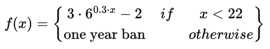

# Extend ipt_geofence with a flexible function to calculate ban time for each host.
Donaldo Buzi, <d.buzi@studenti.unipi.it>

## Goal and implementation description
Extend [ipt_geofence](https://github.com/ntop/ipt_geofence) to allow banning each host for a duration depending on how many times the host attempted to send/receive data.
You can save the ip addresses in a human-readable file or in a serialized one (see the following sections to learn about the differences).
You can specify your output file from command line and customize the function parameters and the logger costants.

## How to use
Set the `-d` option when running ipt_geofence with the desired output file name. 

Example : `sudo ./ipt_geofence -c config.json -m country.mmdb -d output.json `.

Note: if you want to save a human-readable file, you should also set `IS_HUMAN_READABLE` to `true` within `BannedIpLogger.cpp`.

If you want to save it in binary format, then you can set `IS_HUMAN_READABLE` to `false` and specify the file as in the following example: `output.bin`.

To customize the function that calculates the banning time you can edit the following parameters:
`function_a = 3, function_base = 6, function_b = 0.3, function_offset = -2, max_matches = 22`.

The default function looks like this:

    

    
    
<!-- comment to close gap
    -->

    
    

By editing the parameters mentioned above within the file 
`WatchMatches.cpp`, you can easily customize this function.

Note: The function returns the banning time expressed in seconds.

If want to dump a file in any case for logging purposes, then you cannnot specify the `-d` option and set `SAVE_ANYWAYS` to `True` within `BannedIpLogger.cpp` . The generated file will be called `ip_list_dumped.json`.

Note: This option make sense if combined with `IS_HUMAN_READABLE`, so make sure to set it also to `true`. 

## How to run
1. Clone the repository from https://github.com/ntop/ipt_geofence, with `git clone https://github.com/ntop/ipt_geofence.git`
2. Run `./autogen.sh` in the base folder of the project
3. Run `make`
4. `sudo ipt_config_utils/single_iface.sh`
5. Finally, run `sudo ./ipt_geofence -c config.json -m dbip-country.mmdb -d output.json`-

Make sure that each step succeed.

To run the test for BannedIpLogger do as following:
1. Run `make test`
2. Run `sudo ./ipt_test`.

This will execute the default 5 test cases under ipt_config_utils//test.

Note: The last test case depends on how long you let ipt_geofence run.
## Statistics
In the following photos, you can see the difference in computation time and file size when saving data once in binary format and once in JSON:

  

 

  

The test was executed by creating 100.000 ip addresses. Firstly, we saved them in persistent storage and then loaded them back in ram. Please note that the computation time can be lower than the one shown, due to valgrind being used during the test.

However, the computation time isn't that impactful, as we load and save the file only at the first run and at exit time. We can observe the difference in file size in the following photo:
  

  

Using json can lead to a file twice as big! Hence, if you want to save memory, it's suggested to use the serialized file.

Note: When you want to save the file as bin, make sure to also set `IS_HUMAN_READABLE` to `false`, otherwise it will save the file as bin but with a json format, thus loosing the benefits.

## Changes
 The affected files are: 
 Makefile.in, Main.cpp, NwInterface.cpp, MatchWatches.h, BannedIpLogger.cpp, BannedIpLogger.h and BannedIpTest.cpp.
 You can find all the changes in the following url:
 https://github.com/ntop/ipt_geofence/compare/main...AldoBuzi:ipt_geofence:main

## File json example
    {
      "list" : 
      [
        {
          "ip" : "192.168.1.3",
          "lastSeen" : 1713791440,
          "matches" : 3
        },
        {
          "ip" : "192.168.1.1",
          "lastSeen" : 1713791440,
          "matches" : 1
        },
        {
          "ip" : "192.168.1.2",
          "lastSeen" : 1713791440,
          "matches" : 2
        }
      ]
    }
